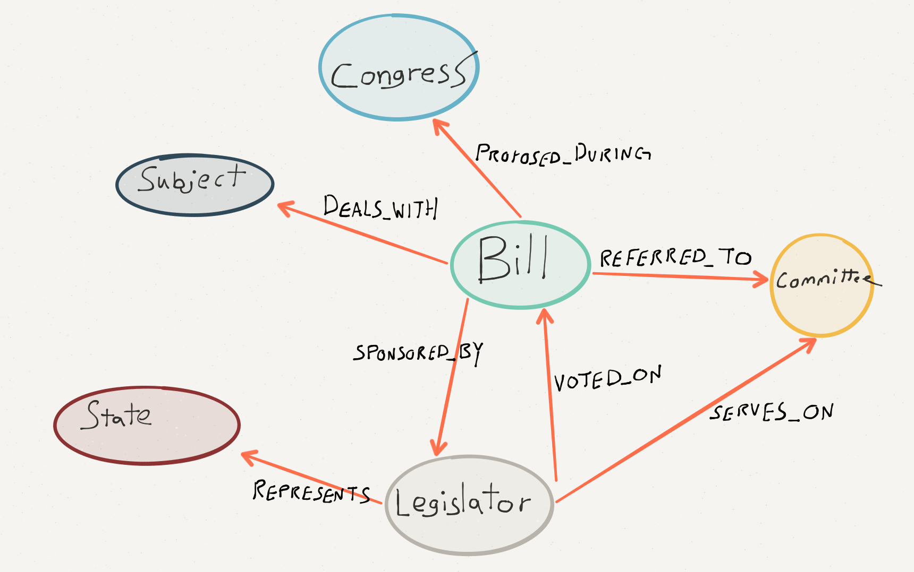

# Legislative Graph

A set of scripts to easily download and import US legislative data into a Neo4j
database. This is a work-in-progress, please submit an issue for any errors or feature requests.

## Data Model

The data model incorporates a small amount of the data available from GovTrack. Please submit an issue to request any changes / updates. We're really interested in how the commmunity might want to use this data so please let us know!



Also, [this file](schema.md) has more detailed information about the data model.

## Quickstart

A read-only version of legis-graph with data from the 114th Congress is running in a Neo4j instance at [http://52.70.212.93/browser/](http://52.70.212.93/browser/) Feel free to make use of this instance to explore legis-graph.

For convenience, data from the 114th Congress is available as a Neo4j datastore. Simply download [this zip archive](https://dl.dropboxusercontent.com/u/67572426/legis-graph.graph.db.zip), extract and replace the `data/graph.db` folder in an existing version of Neo4j.

Alternatively, you can use the [LazyWebCypher tool](http://johnymontana.github.io/LazyWebCypher) with this [link.](http://johnymontana.github.io/LazyWebCypher/?file=https://raw.githubusercontent.com/legis-graph/legis-graph/master/quickstart/114/legis_graph_import_114.cypher)
)

## Load Data

We're currently working to streamline the data loading process, but for now you can follow these steps to load data.

### Download / update data

Sync a particular congress by its number (so, for instance, for the 112th
congress, replace `<num>` with `112`.

```
./sync.sh <num>
```

### Parse data

Use the parse scripts to parse the raw data into CSV files that can be easily
loaded into Neo4j.

```
$ python3 parse_legislators.py
...
$ python3 parse_bills.py
...
$ python3 parse_votes.py
...
$ python3 parse_committees.py
...
$ python3 parse_committee_members.py
...
```

The scripts require Python 3.

### Insert into Neo4j

Use the `*.cql` scripts to load the data into Neo4j. You need to have the data
files available over HTTP, so before you do this step, in another terminal
window, just run `$ python -m http.server` in the repository root.

Be sure Neo4j is running, by default legis-graph assumes Neo4j is running locally.

```
$ path/to/neo4j/bin/neo4j-shell < load_legislators.cql
...
$ path/to/neo4j/bin/neo4j-shell < load_bills.cql
...
$ path/to/neo4j/bin/neo4j-shell < load_subjects.cql
...
$ path/to/neo4j/bin/neo4j-shell < load_congresses.cql
...
$ path/to/neo4j/bin/neo4j-shell < load_bills_congresses.cql
...
$ path/to/neo4j/bin/neo4j-shell < load_bills_subjects.cql
...
$ path/to/neo4j/bin/neo4j-shell < load_bills_legislators.cql
...
$ path/to/neo4j/bin/neo4j-shell < load_votes.cql
...
$ path/to/neo4j/bin/neo4j-shell < load_committees.cql
...
$ path/to/neo4j/bin/neo4j-shell < load_committee_members.cql
...
```

## Queries

Once the data is loaded in Neo4j we can use queries written in Cypher to discover interesting things about Congress.

### General Queries

Find all Legislators:

~~~cypher
MATCH (n:Legislator) RETURN n LIMIT 100
~~~

Find Steve Daines:

~~~cypher
MATCH (n:Legislator {firstName: "Steve", lastName: "Daines"}) RETURN n
~~~

What Bills did Steve Daines sponsor?

~~~cypher
MATCH (n:Legislator {firstName: "Steve", lastName: "Daines"})<-[:SPONSORED_BY]-(b:Bill) RETURN b
~~~

For how many Bills did Steve Daines vote Yea?

~~~cypher
MATCH (n:Legislator {firstName: "Steve", lastName: "Daines"})-[v:VOTED_ON]->(b:Bill) 
WHERE v.vote = "Yea"
RETURN b
~~~

### More advanced queries

Find the number of bills proposed during each congress in the database.

```cypher
MATCH (c:Congress)<-[:PROPOSED_DURING]-(b:Bill)
RETURN c.number AS congress, count(b) as numProposed
```

Find the number of bills enacted in each congress in the database and the
average number of sponsors bills had during that congress.

```cypher
MATCH (c:Congress)<-[:PROPOSED_DURING]-(b:Bill)-[:SPONSORED_BY]->(l:Legislator)
WHERE b.enacted = 'True'
WITH c, b, count(l) AS numSponsors
RETURN c.number AS congress, count(b) AS numPassed, avg(numSponsors) AS avgSponsors
```

## Articles

* [Introducing legis-graph - US Congressional Data With Govtrack and Neo4j](http://www.lyonwj.com/2015/09/20/legis-graph-congressional-data-using-neo4j/)
* [Congressional PageRank - Analyzing US Congress With Neo4j and Apache Spark](http://www.lyonwj.com/2015/10/11/congressional-pagerank/)

## Authors

* [William Lyon](http://github.com/johnymontana)
* [George Lesica](http://github.com/glesica)

## Terms

The software in this repository is provided "AS-IS" without warranties or guarantees of any kind. Data used by this software is provided by [Govtrack.us](http://govtrack.us) and should be used under the terms specified by Govtrack.us [here](https://www.govtrack.us/developers/license).

